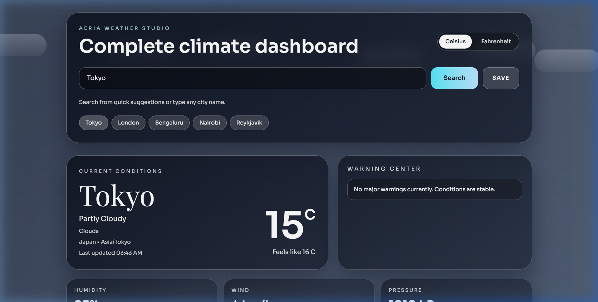
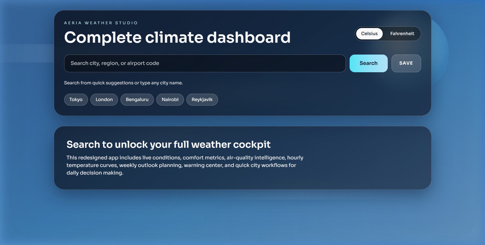
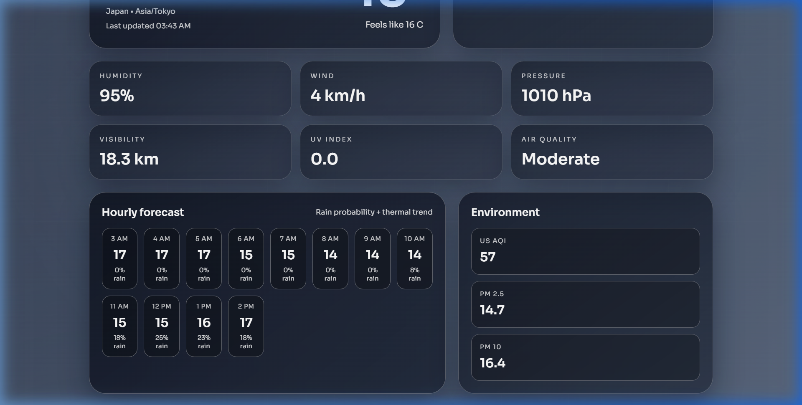

# Aeria Weather Studio

A real-time climate dashboard built with a Rust backend and Next.js frontend, packaged as a native Windows desktop app using Tauri.

**[Live Demo](https://aeria-weather.vercel.app)** · **[Download Installer](https://github.com/VaibhavK289/weather-app/releases)**

---



## Features

- **Live weather data** for any city worldwide via the Open-Meteo API
- **Current conditions** — temperature, feels-like, humidity, wind speed, pressure, visibility
- **Hourly forecast** — 12-hour temperature trend with rain probability
- **7-day outlook** — daily highs/lows, sunrise/sunset, precipitation chance
- **Air quality monitoring** — US AQI, PM2.5, PM10 readings
- **Warning center** — high UV, heavy precipitation, strong wind, extreme temperature alerts
- **Dynamic weather scenes** — background gradients and animations change based on current conditions (sunny, rainy, stormy, snowy, foggy, cloudy)
- **Unit toggle** — switch between Celsius and Fahrenheit
- **Favorites and recents** — save cities and quickly revisit recent searches
- **Desktop installer** — ships as a native Windows `.exe` via Tauri (NSIS)

## Screenshots

<details>
<summary>Landing page</summary>


</details>

<details>
<summary>Hourly forecast and air quality</summary>


</details>

## Architecture

```
weather-app/
├── backend/           # Rust API server (Axum + Tokio)
│   └── src/main.rs    # Routes: /health, /weather/:city
├── frontend/          # Next.js web app + Tauri desktop shell
│   ├── src/app/       # React UI (page.tsx, layout.tsx, globals.css)
│   ├── src-tauri/     # Tauri config, Rust entry point, capabilities
│   └── scripts/       # Desktop build helper
├── shared/            # Shared Rust crate (data types used by backend)
├── Cargo.toml         # Rust workspace root
└── render.yaml        # Render deployment config
```

The project is organized as a **Rust workspace** with three members:

| Crate | Purpose |
|---|---|
| `backend` | Axum HTTP server that geocodes city names and fetches weather + air quality data from Open-Meteo |
| `shared` | Common data types (`WeatherReport`, `CurrentWeather`, `HourlyForecast`, etc.) shared between crates |
| `frontend/src-tauri` | Tauri desktop shell that wraps the Next.js frontend into a native window |

### How it works

1. The user searches for a city in the frontend
2. The frontend sends a request to the Rust backend at `/weather/:city`
3. The backend geocodes the city name via Open-Meteo's geocoding API
4. It then fetches current conditions, hourly forecast, daily forecast, and air quality data in parallel
5. The backend assembles a `WeatherReport` struct and returns it as JSON
6. The frontend renders the data with dynamic weather-themed backgrounds and animations

### Deployment

- **Frontend** — deployed on [Vercel](https://aeria-weather.vercel.app) (Next.js)
- **Backend** — deployed on [Render](https://weather-app-backend-nbwv.onrender.com) (Rust binary, free tier)
- **Desktop** — packaged via Tauri into a Windows NSIS installer

> **Note:** The Render free tier spins down after inactivity. The first request after idle may take 30-60 seconds while the service cold-starts.

## Tech Stack

| Layer | Technology |
|---|---|
| Backend framework | [Axum](https://github.com/tokio-rs/axum) |
| Async runtime | [Tokio](https://tokio.rs) |
| HTTP client | [Reqwest](https://github.com/seanmonstar/reqwest) |
| Serialization | [Serde](https://serde.rs) |
| Frontend framework | [Next.js 16](https://nextjs.org) (React 19) |
| Styling | [Tailwind CSS 4](https://tailwindcss.com) |
| Desktop shell | [Tauri 2](https://v2.tauri.app) |
| Weather data | [Open-Meteo API](https://open-meteo.com) |

## Getting Started

### Prerequisites

- [Rust](https://rustup.rs) (stable toolchain)
- [Node.js](https://nodejs.org) (LTS)
- [Microsoft C++ Build Tools](https://visualstudio.microsoft.com/visual-cpp-build-tools/) (for Tauri on Windows)

### Run the backend

```bash
cd backend
cargo run
```

The API server starts at `http://127.0.0.1:8000`. Test it:

```bash
curl http://127.0.0.1:8000/weather/London
```

### Run the frontend

```bash
cd frontend
npm install
npm run dev
```

Opens at `http://localhost:3000`. The frontend connects to the local backend by default.

### Build the desktop installer

From the `frontend` directory:

```powershell
npm install
npm run tauri:build
```

The installer is generated at:

```
frontend/src-tauri/target/release/bundle/nsis/weather-app_0.2.0_x64-setup.exe
```

The desktop build automatically points to the deployed Render backend. To override:

```powershell
$env:DESKTOP_API_BASE_URL="https://your-backend-url.com"
npm run tauri:build
```

## API Reference

| Endpoint | Method | Description |
|---|---|---|
| `/health` | GET | Health check, returns `ok` |
| `/weather/:city` | GET | Returns full weather report for the given city |

### Example response

```json
{
  "city": "Tokyo",
  "country": "Japan",
  "timezone": "Asia/Tokyo",
  "latitude": 35.6895,
  "longitude": 139.6917,
  "current": {
    "temperature_c": 22.5,
    "humidity": 65,
    "wind_kmh": 12.0,
    "uv_index": 5.2,
    "description": "Partly cloudy"
  },
  "hourly": [...],
  "daily": [...],
  "air_quality": {
    "us_aqi": 42,
    "pm2_5": 8.5,
    "pm10": 12.3
  }
}
```

## License

MIT
